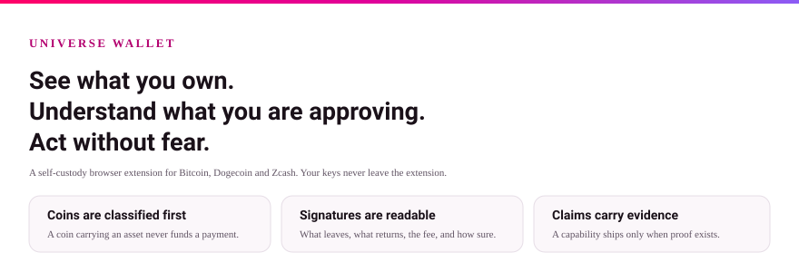
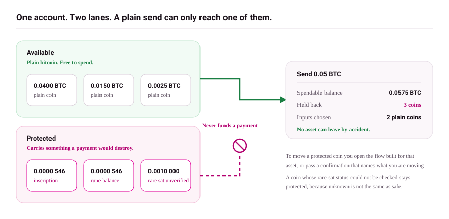
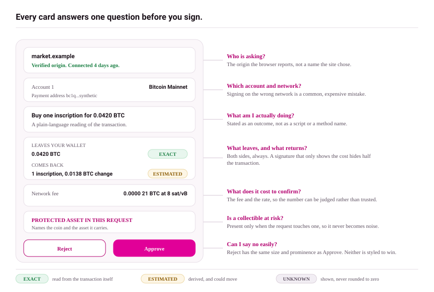
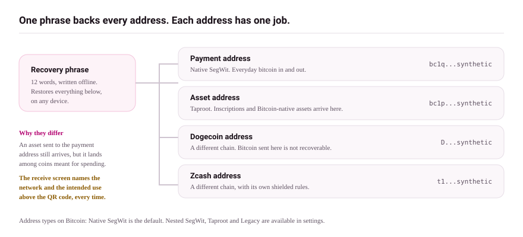

# Universe Wallet

**Universe Wallet shows what your Bitcoin addresses own, protects it from accidental spending, and signs only what you can read and approve.**

Universe Wallet is a self-custody browser extension for Bitcoin, Dogecoin, and Zcash. It keeps asset-bearing coins out of ordinary payments and puts a plain-language review in front of every signature. Your keys never leave the extension.

## Install

Install [Universe Bitcoin Wallet from the Chrome Web Store](https://chromewebstore.google.com/detail/universe-bitcoin-wallet/fjalkkkbjffhgdoheannkodafhemfdba). The publisher is **Universe**. The extension works in Chromium browsers with Chrome 88 or newer.

Setup takes about two minutes: [Install](getting-started/install.md), then [create a wallet](getting-started/create-a-wallet.md) or [import one](getting-started/import-a-wallet.md).

> The listing currently serves an older build than this documentation describes. Check the version shown on `chrome://extensions` against the version below before relying on anything on this page.

## Protocol support in this release

<!-- capability:support-state start -->

**No protocol operation is authorized in 1.7.5.8.**

The wallet carries code for 42 protocols, and the release intends to ship many of
them. None of them has completed evidence for this build, so every protocol action fails closed:
the screen loads, states that the operation is unavailable, and names what is missing. Bitcoin,
Dogecoin and Zcash balances, receive, send, review, activity, coin control, connections, backup and
recovery are unaffected, because they do not sit behind a protocol gate.

See [why a protocol appears only when evidence proves it](assets-and-protocols/supported-protocols.md).

<!-- capability:support-state end -->

## What makes it different

### Asset-aware spending

Coins that carry inscriptions, tokens, or other indexed assets are shown as **Protected** and never fund a plain payment. You spend them only through a flow built for that asset.

Read [Protected outputs](assets-and-protocols/protected-outputs.md).

### Readable approvals

Every signature request shows what leaves your wallet, what comes back, the fee, and how sure the wallet is about each fact, marked `EXACT`, `ESTIMATED`, or `UNKNOWN`. A request the wallet cannot verify says so and stays blocked.

Read [Reviewing a transaction](using-wallet/reviewing-a-transaction.md).

### Evidence-gated releases

A protocol action appears in the product only when the release that shipped it carries current, verified evidence for the full path: wallet, API, indexer, network, and reconciliation. Code existing is not treated as support, which is why the supported list can be shorter than the protocol list.

Read [Supported protocols](assets-and-protocols/supported-protocols.md).

### Connections that expire

A connected site sees one address, must ask again to sign, and loses access after the idle window you choose.

Read [Connections](using-wallet/connections.md).

### Expert control without expert risk

Coin control, transaction inspection, address whitelists, spending limits, and a security dashboard are built in and off by default. Read [Coin control](using-wallet/coin-control.md).

## Networks

<!-- capability:networks start -->

| Chain | Unit | Networks |
| --- | --- | --- |
| Bitcoin | BTC | Mainnet, Signet, Testnet, Testnet4 |
| Cosmos | BABY | bbn-1 |
| Dogecoin | DOGE | Mainnet, Testnet |
| Fractal Bitcoin | FB | Mainnet, Testnet |
| Zcash | ZEC | Mainnet, Testnet |

<!-- capability:networks end -->

Address types on Bitcoin: Native SegWit (default), Nested SegWit, Taproot, and Legacy.

Bitcoin, Dogecoin and Zcash are chains you switch between. Fractal Bitcoin is a separate chain with its own network. The Cosmos network belongs to Babylon staking and is reached from that flow rather than from the network switcher.

Details in [Accounts and networks](wallet-basics/accounts-and-networks.md).

## Self-custody, in plain words

You hold the keys. Universe cannot move your funds, cannot reverse a confirmed transaction, and cannot restore a lost recovery phrase. Write your 12 words down offline before you deposit anything.

Read [Backup](security-and-recovery/backup.md) and [Restore](security-and-recovery/restore.md) so you know the exit works before you need it.

## Documentation

| Section | Start here |
| --- | --- |
| Getting started | [Install](getting-started/install.md) · [Create a wallet](getting-started/create-a-wallet.md) · [Import a wallet](getting-started/import-a-wallet.md) · [Hardware wallets](getting-started/connect-hardware.md) · [First receive](getting-started/first-receive.md) · [First send](getting-started/first-send.md) |
| Wallet basics | [Accounts and networks](wallet-basics/accounts-and-networks.md) · [Balances](wallet-basics/balances.md) · [Fees](wallet-basics/fees.md) · [Activity](wallet-basics/activity.md) · [Speed and media](wallet-basics/performance-and-media.md) |
| Assets and protocols | [Overview](assets-and-protocols/overview.md) · [Protected outputs](assets-and-protocols/protected-outputs.md) · [Supported protocols](assets-and-protocols/supported-protocols.md) · [Dogecoin marketplace](assets-and-protocols/dogecoin-marketplace.md) · [Zcash market listings](assets-and-protocols/zcash-market-listings.md) |
| Using the wallet | [Reviewing a transaction](using-wallet/reviewing-a-transaction.md) · [Signing a message](using-wallet/signing-a-message.md) · [Connections](using-wallet/connections.md) · [Coin control](using-wallet/coin-control.md) |
| Security and recovery | [Security model](security-and-recovery/security-model.md) · [Backup](security-and-recovery/backup.md) · [Restore](security-and-recovery/restore.md) · [Watch-only wallets](security-and-recovery/watch-only.md) · [If your wallet is compromised](security-and-recovery/compromised-wallet.md) · [Privacy](security-and-recovery/privacy.md) |
| Developers | [Provider API](developers/provider-api.md) |
| Reference | [Supported features](reference/supported-features.md) · [Glossary](reference/glossary.md) · [Known limitations](reference/known-limitations.md) |
| Help | [Troubleshooting](troubleshooting/README.md) · [Support](support/README.md) |

Diagrams on this page are hand-authored SVG. Their conventions and palette are in the [diagram style guide](assets/diagrams/_shared-style.md).

## Support and security reporting

Bug reports and feature requests: [GitHub issues](https://github.com/bitcoinuniverseio/wallet/issues). Suspected vulnerabilities: email `legal@bitcoinuniverse.io` and do not open a public issue. More paths in [Support](support/README.md).

## Version

<!-- capability:version start -->

This documentation describes Universe Wallet 1.7.5.8.

<!-- capability:version end -->

The version, the network table, and the protocol support state above are generated from the wallet's own release matrix, so this page cannot claim a capability the build does not authorize.

Release notes ship with each version on the [releases page](https://github.com/bitcoinuniverseio/wallet/releases). Terms: [bitcoinuniverse.io/terms](https://bitcoinuniverse.io/terms). Privacy policy: [bitcoinuniverse.io/privacy](https://bitcoinuniverse.io/privacy).
