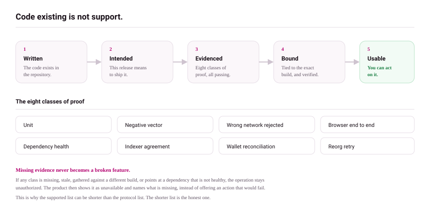

# Supported protocols

There are two different lists on this page, and the difference between them matters more than either one.

The **authorized** list is what you can actually use. It is generated from the release matrix of the build this documentation describes, so it cannot claim something the build does not permit.

The **intent** list further down is what the wallet implements and means to ship. An operation on the intent list still fails closed until evidence authorizes it.

## Authorized in this release

<!-- capability:protocols start -->

| Protocol | State in this release | Operations you can use |
| --- | --- | --- |
| Alkanes | Not in this release | None |
| ARC-20 | Not in this release | None |
| Atomicals | Not in this release | None |
| Babylon | Not in this release | None |
| BIP-110 | Not in this release | None |
| Bitcoin | Not in this release | None |
| Bitmap | Not in this release | None |
| BLOCK-20 | Not in this release | None |
| BlockDrop | Not in this release | None |
| BRC-110 | Not in this release | None |
| BRC-20 | Not in this release | None |
| CAT-20 | Not in this release | None |
| CAT-721 | Not in this release | None |
| ChainBloom | Not in this release | None |
| DMT | Not in this release | None |
| Doge TAP | Not in this release | None |
| Dogecoin | Not in this release | None |
| Dogecoin marketplace | Not in this release | None |
| Doginals | Not in this release | None |
| DRC-20 | Not in this release | None |
| DROPS | Not in this release | None |
| DUST-20 | Not in this release | None |
| Fractal Bitcoin | Not in this release | None |
| Mezcal | Not in this release | None |
| OP Inscriptions | Not in this release | None |
| OP Names | Not in this release | None |
| OP_RETURN | Not in this release | None |
| OP-20 | Not in this release | None |
| OP-DROP | Not in this release | None |
| Ordinals | Not in this release | None |
| Patina | Not in this release | None |
| Runes | Not in this release | None |
| SRC-101 | Not in this release | None |
| SRC-20 | Not in this release | None |
| Stamps | Not in this release | None |
| TAP | Not in this release | None |
| UNAT | Not in this release | None |
| Witness Circles | Not in this release | None |
| Zerdinals | Not in this release | None |
| ZRC-20 (Zecscriptions) | Not in this release | None |
| ZRC-20 (Zord) | Not in this release | None |
| ZRunes | Not in this release | None |

<!-- capability:protocols end -->

## What the wallet intends to ship

Everything below describes implementation and intent, not availability.

- **Operations** are what the product implements and intends to offer: `read` (see holdings), `explore`, `deploy`, `mint`, `etch`, `transfer`, `inscribe`, `send`, `sign`, `broadcast`, `marketplace`, `market-list`, `market-buy`.
- An operation is **live in your build only when that release authorized it with current evidence** for wallet, API, indexer, network, and reconciliation. Anything not authorized shows **Protocol operation unavailable** and names what is missing. See [the release rule](overview.md).
- Networks named are the ones the registry covers; test networks share the mainnet entry.
- These tables are maintained by hand against the registry. The authorized table above is generated, so where the two disagree, the generated one is correct.

## Bitcoin

| Protocol | Networks | Operations |
| --- | --- | --- |
| Bitcoin (BTC) | mainnet, testnet, testnet4, signet | read, send, sign, broadcast |
| Ordinals | mainnet, testnet, testnet4, signet | read, inscribe, transfer, sign, broadcast |
| BRC-20 | mainnet, testnet, testnet4, signet | read, explore, deploy, mint, transfer, sign, broadcast |
| Runes | mainnet, testnet, testnet4, signet | read, explore, mint, etch, transfer, sign, broadcast |
| Alkanes | mainnet, testnet, testnet4, signet | read, explore, mint, sign, broadcast |
| TAP | mainnet, testnet, testnet4, signet | read, explore, deploy, mint, transfer, sign, broadcast |
| SRC-20 (Stamps) | mainnet, testnet, testnet4, signet | read, explore, deploy, mint, transfer, sign, broadcast |
| Stamps | mainnet, testnet, testnet4, signet | read, explore, inscribe, sign, broadcast |
| SRC-101 | mainnet, testnet, testnet4, signet | read, explore |
| DUST-20 | mainnet, testnet, testnet4, signet | read, explore, deploy, mint, transfer, sign, broadcast |
| UNAT | mainnet, testnet, testnet4, signet | read, explore, mint, transfer, sign, broadcast |
| Bitmap | mainnet, testnet, testnet4, signet | read, explore, mint, transfer, sign, broadcast |
| BLOCK-20 | mainnet, testnet, testnet4, signet | read, explore, deploy, mint, transfer, sign, broadcast |
| OP_RETURN | mainnet, testnet, testnet4, signet | read, explore, deploy, mint, transfer, inscribe, sign, broadcast |
| OP-20 | mainnet, testnet, testnet4, signet | read, explore, deploy, mint, transfer, sign, broadcast |
| OP Names | mainnet, testnet, testnet4, signet | read, explore, inscribe, transfer, sign, broadcast |
| OP Inscriptions | mainnet, testnet, testnet4, signet | read, explore, inscribe, sign, broadcast |
| Mezcal | mainnet, testnet, testnet4, signet | read, explore, mint, etch, sign, broadcast |
| Atomicals | mainnet, testnet, testnet4, signet | read, mint, transfer, sign, broadcast |
| ARC-20 | mainnet, testnet, testnet4, signet | read, explore, deploy, mint, transfer, sign, broadcast |
| DMT | mainnet, testnet, testnet4, signet | read, explore, deploy, mint, transfer, sign, broadcast |
| BlockDrop | mainnet, testnet, testnet4, signet | read, explore, deploy, mint, transfer, sign, broadcast |
| OP-DROP | mainnet, testnet, testnet4, signet | read, explore, deploy, mint, transfer, sign, broadcast |
| DROPS | mainnet, testnet, testnet4, signet | read, explore |
| ChainBloom | mainnet, testnet, testnet4, signet | read, explore |
| Patina | mainnet, testnet, testnet4, signet | read, explore |
| Witness Circles | mainnet, testnet, testnet4, signet | read, explore |
| BIP-110 | mainnet, testnet, testnet4, signet | read, explore |

BRC-110 exists in the registry but is disabled by release policy.

## Dogecoin

| Protocol | Networks | Operations |
| --- | --- | --- |
| Dogecoin (DOGE) | mainnet, testnet | read, send, sign, broadcast |
| Doginals | mainnet, testnet | read, explore, inscribe, transfer, sign, broadcast |
| DRC-20 | mainnet, testnet | read, explore, deploy, mint, transfer, sign, broadcast |
| Doge TAP | mainnet, testnet | read, explore, mint, broadcast |
| Dogecoin Marketplace | mainnet, testnet | read, explore, marketplace, sign, broadcast |

Marketplace signing details: [Dogecoin marketplace](dogecoin-marketplace.md).

## Zcash

| Protocol | Networks | Operations |
| --- | --- | --- |
| Zerdinals | mainnet, testnet | read, explore, inscribe, transfer, market-list, market-buy, sign, broadcast |
| ZRunes | mainnet, testnet | read, explore, etch, mint, transfer, sign, broadcast |

Market listing signing details: [Zcash market listings](zcash-market-listings.md).

## Fractal Bitcoin

| Protocol | Networks | Operations |
| --- | --- | --- |
| Fractal Bitcoin | mainnet, testnet | read, explore |
| CAT-20 | mainnet, testnet | read, explore, transfer, sign, broadcast |
| CAT-721 | mainnet, testnet | read, explore, transfer, sign, broadcast |

CAT balances, collections, and transfers are available only while the wallet is connected to Fractal Bitcoin. They are never queried or offered on Bitcoin mainnet, testnet, testnet4, or signet.

## Other

| Protocol | Networks | Operations |
| --- | --- | --- |
| Babylon | bbn-1 | read, explore |

## Version

The intent tables above cover the 42 protocols in the registry. They are not a support claim. Your build offers only what the generated authorized table at the top of this page lists, and the product states the reason on any screen whose operation was not authorized.
