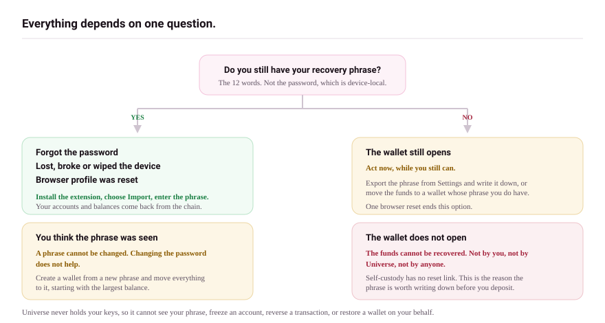

# Restore

This page proves the exits work: how to get your wallet back after a lost device, a wiped browser, or a move to different software.

## What you need

One of:

- your 12-word recovery phrase (restores everything), or
- a private key export (restores that single address), or
- your Keystone device (its own seed restores hardware accounts).

Your password is not needed and does not help; it belonged to the old device.

## Browser profile lost, extension removed, or new computer

1. [Install the extension](../getting-started/install.md) fresh.
2. Choose **I already have a wallet** and follow [Import a wallet](../getting-started/import-a-wallet.md) with your phrase.
3. Pick the source wallet as **Unisat Wallet** if the phrase was created in Universe Wallet; the address types match.
4. Check the balance, then re-create what was device-local: connected sites, frozen coins, contacts, and limits are settings, not funds, and settings do not travel with the phrase.

## Hardware accounts

Reconnect the Keystone as in [Connect a hardware wallet](../getting-started/connect-hardware.md). The device seed never depended on the browser. If the device itself is lost, restore its seed onto a replacement device per Keystone's own documentation, then reconnect.

## Moving to or from another wallet

The phrase is standard BIP-39. Universe imports phrases from Unisat, Sparrow, Xverse, Ordinals Wallet, and others, and those wallets can import a phrase created here; choose matching address types (Universe defaults to Native SegWit, assets usually sit on Taproot). Before moving significant funds, do a dry run: import, confirm the same addresses appear, and send a small test.

If you hold protocol assets, prefer a destination wallet that understands them; a wallet that cannot see an inscription can still destroy it by spending its coin as fee or change.

## If a Universe service is down

Your funds are on the chain, not on Universe servers. With the phrase you can always restore into other standard software and spend plain coins. Asset-aware operations are best done in a wallet with asset protection once services return; see [Protected outputs](../assets-and-protocols/protected-outputs.md) for why.

## What can go wrong

- **Restored, balance zero.** Wrong address type or a missing BIP-39 passphrase. See the checklist in [Import a wallet](../getting-started/import-a-wallet.md).
- **Phrase partly unreadable.** Try your second copy. There is no service that can fill in missing words; that impossibility is what makes the phrase safe.

## Next

- [Backup](backup.md), so the next restore is boring
- [Watch-only wallets](watch-only.md)
