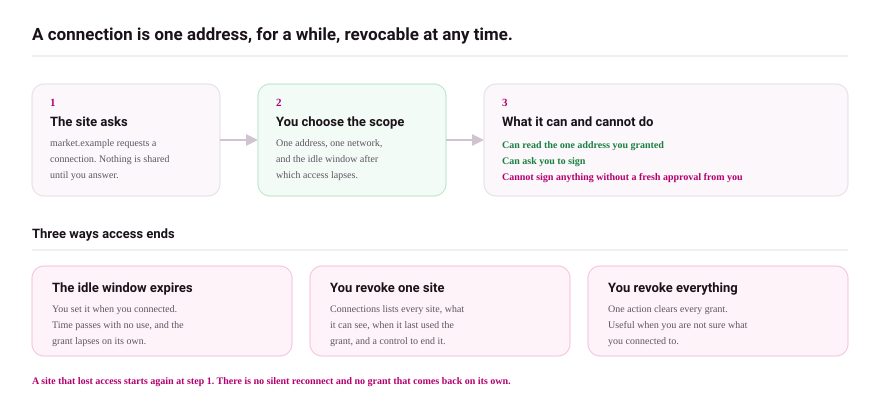

# Connections

This page explains what a site can and cannot do once connected, how access expires, and how to audit or revoke it.

## What connecting means

When a site asks to connect, Universe opens **Connect with Universe** and shows exactly what you are granting, as a three-line summary on the request itself:

- *This site can see your selected address.*
- *It can request signatures later.*
- *It cannot move funds without another approval.*

You choose which account to share. Connecting never authorizes spending; every transaction or message still opens its own approval. Known phishing sites are blocked outright: the request is replaced by a **Phishing Detection** screen whose only safe action is rejection.

## Access expires on its own

A connection that sits idle loses access without your help. The idle window is yours to set: **24 hours**, **7 days**, **30 days** (default), or **Until I disconnect**. Each connected site shows its remaining lifetime, and an expired site must ask again from scratch.

## The Connected Sites screen

**Settings → Connected Sites** lists every live connection with its origin, account, and expiry. From here you can:

- **Disconnect** any site immediately;
- run the local audit, which checks origin safety, stale permissions, and impersonation signals, and scores each site;
- **Revoke risky dApps** in one step when the audit flags any;
- **Copy audit** for your records.

The list is local to your device. An empty list means no site currently has access.

## Habits that keep you safe

- Connect only on sites you navigated to yourself, never from a link in a message you did not expect.
- Prefer the shortest idle window that fits your use.
- Sweep the Connected Sites screen occasionally; disconnect anything you no longer use, and let the idle expiry catch what you forget.

## What can go wrong

- **A site you trusted turns hostile.** Disconnect it. Any damage requires an approval you would still have to sign; review anything pending with [transaction review](reviewing-a-transaction.md).
- **A site keeps asking to connect.** Its access expired or you disconnected it. That is the system working; reconnect only if you still use the site.

## Next

- [Signing a message](signing-a-message.md)
- [Security model](../security-and-recovery/security-model.md)
